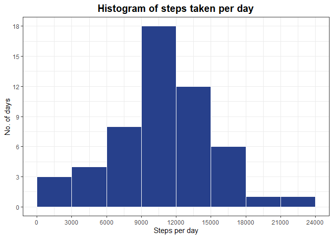
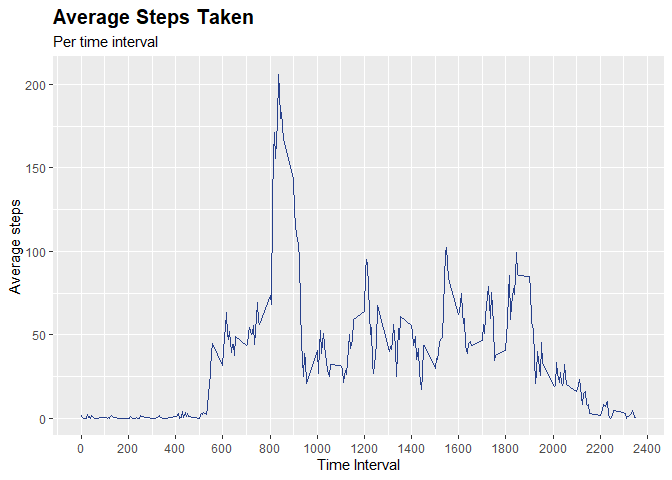

---

**Setting some global options**


```r
knitr::opts_chunk$set(
  comment = "", 
  message=F, 
  warning = F
)
```

**Loading required packages**   


```r
packages <- c("ggplot2", "dplyr")

if("pacman" %in% rownames(installed.packages()) == F){
  install.packages("pacman")
  pacman::p_load(packages)
} else {
  pacman::p_load(packages, character.only = T)
}
```


## Loading and preprocessing the data

**Question:**  
Show any code that is needed to -

1. Load the data   
2. Process/transform the data (if necessary) into a format suitable for your analysis   

Get help with your [R and Statistics assignments](https://www.homeworkhelponline.net "Statistics programming help").

**Solution:**  

Loading the data:

```r
init.activity <- read.csv(unz("activity.zip", "activity.csv"), 
                     colClasses=c("numeric", "Date", "numeric"))
```


```r
summary(init.activity)
```

```
     steps             date               interval     
 Min.   :  0.00   Min.   :2012-10-01   Min.   :   0.0  
 1st Qu.:  0.00   1st Qu.:2012-10-16   1st Qu.: 588.8  
 Median :  0.00   Median :2012-10-31   Median :1177.5  
 Mean   : 37.38   Mean   :2012-10-31   Mean   :1177.5  
 3rd Qu.: 12.00   3rd Qu.:2012-11-15   3rd Qu.:1766.2  
 Max.   :806.00   Max.   :2012-11-30   Max.   :2355.0  
 NA's   :2304                                          
```


```r
activity <- subset(init.activity, !is.na(init.activity$steps))
summary(activity)
```

```
     steps             date               interval     
 Min.   :  0.00   Min.   :2012-10-02   Min.   :   0.0  
 1st Qu.:  0.00   1st Qu.:2012-10-16   1st Qu.: 588.8  
 Median :  0.00   Median :2012-10-29   Median :1177.5  
 Mean   : 37.38   Mean   :2012-10-30   Mean   :1177.5  
 3rd Qu.: 12.00   3rd Qu.:2012-11-16   3rd Qu.:1766.2  
 Max.   :806.00   Max.   :2012-11-29   Max.   :2355.0  
```


## What is mean total number of steps taken per day? {.tabset .tabset-fade .tabset-pills}

**Questions:**  
For this part of the assignment, you can ignore the missing values in the dataset.

1. Calculate the total number of steps taken per day
2. If you do not understand the difference between a histogram and a barplot, research the difference between them. Make a histogram of the total number of steps taken each day
3. Calculate and report the mean and median of the total number of steps taken per day

**Solutions:**   

### Answer 1

Calculating total number of steps taken per day - 

```r
perday.steps <- aggregate(steps ~ date, data = activity, FUN = sum)
head(perday.steps)
```

```
        date steps
1 2012-10-02   126
2 2012-10-03 11352
3 2012-10-04 12116
4 2012-10-05 13294
5 2012-10-06 15420
6 2012-10-07 11015
```

```r
summary(perday.steps)
```

```
      date                steps      
 Min.   :2012-10-02   Min.   :   41  
 1st Qu.:2012-10-16   1st Qu.: 8841  
 Median :2012-10-29   Median :10765  
 Mean   :2012-10-30   Mean   :10766  
 3rd Qu.:2012-11-16   3rd Qu.:13294  
 Max.   :2012-11-29   Max.   :21194  
```

### Answer 2

Making a histogram of the total number of steps taken per day -

```r
perday.steps %>% ggplot() +
  geom_histogram(aes(x = steps), boundary = 0, 
                 binwidth = 3000, col = "white", fill = "royalblue4") +
  scale_x_continuous(breaks = seq(0, 24000, 3000)) +
  scale_y_continuous(breaks = seq(0, 20, 3)) +
  theme_bw() +
  labs(title = "Histogram of steps taken per day",
       x = "Steps per day", y = "No. of days") +
  theme(plot.title = element_text(face = "bold", size = 15, hjust = 0.5))
```

<!-- -->

### Answer 3

Calculating mean - 

```r
mean(perday.steps$steps)
```

```
[1] 10766.19
```
Calculating median - 

```r
median(perday.steps$steps)
```

```
[1] 10765
```

## What is the average daily activity pattern? {.tabset .tabset-fade .tabset-pills}

**Questions:**   

1. Make a time series plot (i.e. type = "l") of the 5-minute interval (x-axis) and the average number of steps taken, averaged across all days (y-axis)
2. Which 5-minute interval, on average across all the days in the dataset, contains the maximum number of steps?

**Solutions:**   

### Answer 1


```r
activity %>% 
  group_by(interval) %>% 
  summarise(average = mean(steps)) %>% 
  ggplot() + 
  geom_line(aes(x = interval, y = average), col = "royalblue4") +
  scale_x_continuous(breaks = seq(0, 2400, 200)) +
  labs(title = "Average Steps Taken", subtitle = "Per time interval",
       x = "Time Interval", y = "Average steps") +
  theme(plot.title = element_text(face = "bold", size = 15, hjust = 0))
```

<!-- -->

### Answer 2


```r
activity %>% 
  group_by(interval) %>% 
  summarise(average = mean(steps)) %>% 
  filter(average == max(average))
```

```
# A tibble: 1 x 2
  interval average
     <dbl>   <dbl>
1      835    206.
```

## Imputing missing values {.tabset .tabset-fade .tabset-pills}

**Questions:**   
Note that there are a number of days/intervals where there are missing values (coded as \color{red}{\verb|NA|}NA). The presence of missing days may introduce bias into some calculations or summaries of the data.

1. Calculate and report the total number of missing values in the dataset (i.e. the total number of rows with \color{red}{\verb|NA|}NAs)
2. Devise a strategy for filling in all of the missing values in the dataset. The strategy does not need to be sophisticated. For example, you could use the mean/median for that day, or the mean for that 5-minute interval, etc.
3. Create a new dataset that is equal to the original dataset but with the missing data filled in.
4. Make a histogram of the total number of steps taken each day and Calculate and report the mean and median total number of steps taken per day. Do these values differ from the estimates from the first part of the assignment? What is the impact of imputing missing data on the estimates of the total daily number of steps?

**Solutions:** 

### Answer 1


```r
summary(init.activity)
```

```
     steps             date               interval     
 Min.   :  0.00   Min.   :2012-10-01   Min.   :   0.0  
 1st Qu.:  0.00   1st Qu.:2012-10-16   1st Qu.: 588.8  
 Median :  0.00   Median :2012-10-31   Median :1177.5  
 Mean   : 37.38   Mean   :2012-10-31   Mean   :1177.5  
 3rd Qu.: 12.00   3rd Qu.:2012-11-15   3rd Qu.:1766.2  
 Max.   :806.00   Max.   :2012-11-30   Max.   :2355.0  
 NA's   :2304                                          
```

```r
(!complete.cases(init.activity)) %>% sum()
```

```
[1] 2304
```
There is in total 2304 rows with missing values (NAs).

### Answer 2

We will use average steps by time interval to replace the missing values.


```r
noNA.activity <- init.activity
med.steps <- aggregate(steps ~ interval, data = noNA.activity, 
                       FUN = mean)
head(med.steps)
```

```
  interval     steps
1        0 1.7169811
2        5 0.3396226
3       10 0.1320755
4       15 0.1509434
5       20 0.0754717
6       25 2.0943396
```

### Answer 3

Replacing missing values with the median values found by grouping of intervals -

```r
noNA.activity$steps <- ifelse(is.na(noNA.activity$steps),
                        med.steps$steps[match(x = init.activity$interval, 
                                              table = med.steps$interval)],
                        noNA.activity$steps)
```


```r
summary(noNA.activity)
```

```
     steps             date               interval     
 Min.   :  0.00   Min.   :2012-10-01   Min.   :   0.0  
 1st Qu.:  0.00   1st Qu.:2012-10-16   1st Qu.: 588.8  
 Median :  0.00   Median :2012-10-31   Median :1177.5  
 Mean   : 37.38   Mean   :2012-10-31   Mean   :1177.5  
 3rd Qu.: 27.00   3rd Qu.:2012-11-15   3rd Qu.:1766.2  
 Max.   :806.00   Max.   :2012-11-30   Max.   :2355.0  
```

```r
str(noNA.activity)
```

```
'data.frame':	17568 obs. of  3 variables:
 $ steps   : num  1.717 0.3396 0.1321 0.1509 0.0755 ...
 $ date    : Date, format: "2012-10-01" "2012-10-01" ...
 $ interval: num  0 5 10 15 20 25 30 35 40 45 ...
```

### Answer 4


```r
noNA.activity %>%
  group_by(date) %>%
  summarise(steps = sum(steps)) %>% 
  ggplot() +
  geom_histogram(aes(x = steps), boundary = 0, 
                 binwidth = 2700, col = "darkgreen", fill = "lightgreen") +
  scale_x_continuous(breaks = seq(0, 22000, 2700)) +
  scale_y_continuous(breaks = seq(0, 20, 3)) +
  theme_bw() +
  labs(title = "Histogram of steps taken per day",
       subtitle = "With new data set with replaced missing values",
       x = "Steps per day", y = "No. of days") +
  theme(plot.title = element_text(face = "bold", size = 15, hjust = 0.5),
        plot.subtitle = element_text(hjust = 0.5))
```

<!-- -->


## Are there differences in activity patterns between weekdays and weekends? {.tabset .tabset-fade .tabset-pills}

**Questions:**
For this part the \color{red}{\verb|weekdays()|}weekdays() function may be of some help here. Use the dataset with the filled-in missing values for this part.

1. Create a new factor variable in the dataset with two levels – “weekday” and “weekend” indicating whether a given date is a weekday or weekend day.
2. Make a panel plot containing a time series plot (i.e. \color{red}{\verb|type = "l"|}type = "l") of the 5-minute interval (x-axis) and the average number of steps taken, averaged across all weekday days or weekend days (y-axis). See the README file in the GitHub repository to see an example of what this plot should look like using simulated data.

**Solutions:**

### Answer 1


```r
noNA.activity$days <- as.factor(weekdays(noNA.activity$date))
condition <- noNA.activity$days %in% c("Saturday", "Sunday")
noNA.activity$weekday <- as.factor(
  ifelse(condition , "weekend", "weekday")
  )
summary(noNA.activity)
```

```
     steps             date               interval             days     
 Min.   :  0.00   Min.   :2012-10-01   Min.   :   0.0   Friday   :2592  
 1st Qu.:  0.00   1st Qu.:2012-10-16   1st Qu.: 588.8   Monday   :2592  
 Median :  0.00   Median :2012-10-31   Median :1177.5   Saturday :2304  
 Mean   : 37.38   Mean   :2012-10-31   Mean   :1177.5   Sunday   :2304  
 3rd Qu.: 27.00   3rd Qu.:2012-11-15   3rd Qu.:1766.2   Thursday :2592  
 Max.   :806.00   Max.   :2012-11-30   Max.   :2355.0   Tuesday  :2592  
                                                        Wednesday:2592  
    weekday     
 weekday:12960  
 weekend: 4608  
                
                
                
                
                
```

### Answer 2


```r
activity.by.date <- aggregate(steps~interval + weekday, 
                              data = noNA.activity,
                              FUN = function(x) round(mean(x),2))
head(activity.by.date)
```

```
  interval weekday steps
1        0 weekday  2.25
2        5 weekday  0.45
3       10 weekday  0.17
4       15 weekday  0.20
5       20 weekday  0.10
6       25 weekday  1.59
```


```r
activity.by.date %>% ggplot(aes(interval, steps)) +
  geom_line(col = "darkblue") +
  facet_wrap(~weekday,ncol = 1) +
  labs(x = "Interval", y = "Number of Steps",
       title = "Patterns of steps in weekday and weekends")
```

<!-- -->

